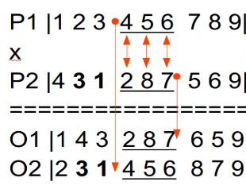

# Metaheuristics

## Description
This repository is a Python project that solves the **Capacitated Vehicle Routing Problem (CVRP)**.
The CVRP is an NP-hard problem, which is why metaheuristics are used to solve it.
The problem consists of `n` locations and a symmetrical matrix of distances between these locations.
The goal is to find the shortest route that visits all locations exactly once.
Additionally, each location has a specific demand for goods that must be delivered in one trip (i.e., you cannot revisit a location to deliver the remaining goods).
The goods are delivered on a truck that has a defined capacity. The truck can visit a special location - warehouse - to refill the goods.
For more details please visit: http://vrp.galgos.inf.puc-rio.br/index.php/en/

In the CVRP case a solution may be represented as a list of integers, where each integer represents a city to visit. Each solution is evaluated by the cost function (which I need to be improved btw.) that calculates the total distance traveled by the truck.

## Configuration
The program is configured using the `config.yaml` file. This allows user to use different algorithms and parameters to try to solve the problem.
Currently, three algorithms/metaheuristics are supported: "greedy", "random", and "genetic".
Here are example configuration parameters:
```yaml
problem_instance: "A-n32-k5"
no_of_runs: 10
algorithm: "genetic"
population_size: 100
generations: 500
crossover_probability: 0.6
mutation_probability: 0.2
mutation_type: 'swap'
tournament_size: 6
```
___
```yaml
problem_instance: "A-n32-k5"
no_of_runs: 1
algorithm: "random"
population_size: 10
generations: 50
```
___
```yaml
problem_instance: "A-n32-k5"
no_of_runs: 1
algorithm: "greedy"
```
## Setup and Run
1. Clone the repository  
`git clone git@github.com:fiflorek/Metaheuristics.git`
2. Create virtual environment  
`python3 -m venv venv`  
`source venv/bin/activate`
3. Install requirements  
`pip install -r requirements.txt`
4. (e is for editable, otherwise omit):
`pip install -e .`
5. Configure algorithm parameters in config.yaml
6. Run the program  
`python cvpr_metahueristics/metaheuristics.py`
The results are saved in the "results" directory relative to where the script is run from.)

## Algorithms
### Greedy
The Greedy algorithm is a simple and deterministic approach. It works by always selecting the next closest city to visit. This method produces a suboptimal solution, but sometimes because of its implementation simplicity it can produce "good enough" results.
The algorithm may also be used as a starting point for more complex ones (i.e., Genetic Algorithm).
### Random
As the name suggests the Random algorithm generates a random sequence of cities to visit and evaluates it. It is often used as a starting point to metaheuristic algorithms. 
In this program the number of solutions generated equals `population_size * generations`.
### Genetic Algorithm
Genetic algorithm is a metaheuristic inspired by the process of natural selection. It works by generating a population of solutions and then evolving them over a number of generations. The algorithm uses crossover and mutation operators to create new solutions.  
#### Flow Diagram  

#### Operators
**Mutation** - as the name suggests, this operator changes the solution. This project has two types of mutation implemented: swap and inversion.
Swap mutation swaps two random genes(cities in cvrp case) in the solution. ```[1, 2, 3, 4, 5]``` -> ```[1, 5, 3, 4, 2]```  
Inversion mutation inverts a random segment of the solution.  ```[1, 2, 3, 4, 5]``` -> ```[1, 4, 3, 2, 5]```  
**Crossover** - this operator combines two solutions to create a new one. This project has two types of crossover implemented so far: OX (Order Crossover) and PMX (Partially Matched Crossover).
Ordered Crossover defines a subset of the first parent's genes and fills the rest of the child with the second parent's genes.  
```[1, 2, 3, 4, 5]``` and ```[5, 4, 3, 2, 1]``` -> ```[1, 4, 3, 2, 5]``` where the subset is ```[4, 3, 2]```  
Partially Matched Crossover defines a mapping between the parents as described in the image below.
  
**Selection** - this operator selects the solutions from the population as parents for the crossover (and effectively next generation). This project uses tournament selection.
Tournament selection works by selecting a random subset of solutions from the population and then selecting the best solution from this subset. It's important to tune this operator parameters - too strict selection may lead to algorithm getting stuck in the local optimum, while too loose selection may lead to the algorithm not converging at all.
I will implement roulette wheel selection in the future.
### Simulated Annealing
Not implemented yet
### Tabu Search
Not implemented yet
